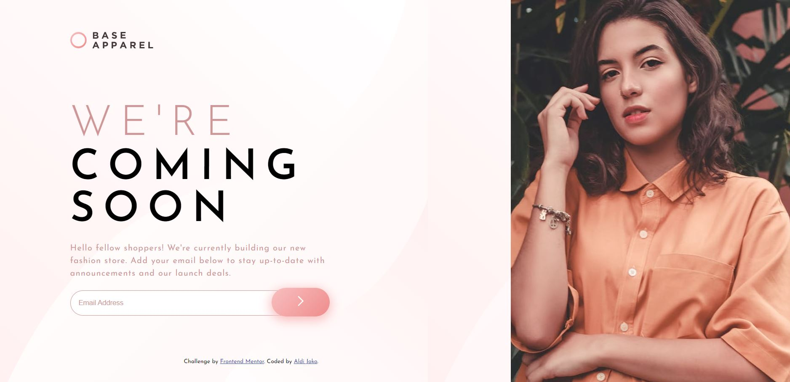

# Frontend Mentor - Base Apparel coming soon page solution

This is a solution to the [Base Apparel coming soon page challenge on Frontend Mentor](https://www.frontendmentor.io/challenges/base-apparel-coming-soon-page-5d46b47f8db8a7063f9331a0). Frontend Mentor challenges help you improve your coding skills by building realistic projects. 

## Table of contents

- [Overview](#overview)
  - [The challenge](#the-challenge)
  - [Screenshot](#screenshot)
  - [Links](#links)
- [My process](#my-process)
  - [Built with](#built-with)
  - [What I learned](#what-i-learned)
  - [Continued development](#continued-development)
  - [Useful resources](#useful-resources)
- [Author](#author)


## Overview

### The challenge

Users should be able to:

- View the optimal layout for the site depending on their device's screen size
- See hover states for all interactive elements on the page
- Receive an error message when the `form` is submitted if:
  - The `input` field is empty
  - The email address is not formatted correctly

### Screenshot



Add a screenshot of your solution. The easiest way to do this is to use Firefox to view your project, right-click the page and select "Take a Screenshot". You can choose either a full-height screenshot or a cropped one based on how long the page is. If it's very long, it might be best to crop it.

Alternatively, you can use a tool like [FireShot](https://getfireshot.com/) to take the screenshot. FireShot has a free option, so you don't need to purchase it. 

Then crop/optimize/edit your image however you like, add it to your project, and update the file path in the image above.

### Links

- Solution URL: [Github](https://github.com/aldijoko/base-apparel)
- Live Site URL: [Live Url](https://aldijoko.github.io/base-apparel/)

## My process

### Built with

- Semantic HTML5 markup
- CSS custom properties
- Flexbox
- Javascript Validation

### What I learned

Use this section to recap over some of your major learnings while working through this project. Writing these out and providing code samples of areas you want to highlight is a great way to reinforce your own knowledge.

To see how you can add code snippets, see below:

```html
<input type="email" class="email" name="email" placeholder="Email Address"/>
```
```js
const form = document.querySelector('form');
const emailInput = document.querySelector('.email');
```

### Continued development

until this section, i still confused how to set mobile design, but i will try my best to create mobile design in the next challange
and this first challange for using js in design, and still learning


### Useful resources

- [Input Email](https://www.w3schools.com/tags/att_input_type_email.asp) - This helped me how to use input for email.
- [Gradient Color](https://www.w3schools.com/css/css3_gradients.asp) - This is an amazing article which helped me how to use gradient for color.
- [JS Validation](https://www.w3schools.com/js/js_validation.asp), (https://www.w3schools.com/jsref/met_document_queryselector.asp), (https://www.w3schools.com/tags/tryit.asp?filename=tryhtml_button_test) - This is for helping me get validation and input button


## Author

- Frontend Mentor - [@aldijoko](https://www.frontendmentor.io/profile/aldijoko)
- Twitter - [@aldijokosp](https://www.twitter.com/aldijokosp)
